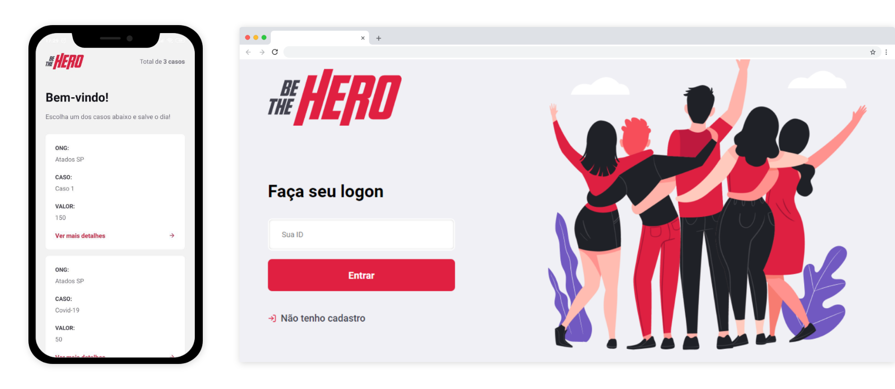

<div align="center" style="display:flex;flex-direction:column;align-items:center">
  
  
  <p>Apoie ONGs, apoie as boas causas, <strong>be a hero!</strong><p>

  [](https://app.netlify.com/sites/be-thehero/deploys) 
  
</div>



## 💡 Sobre o Projeto

A idéia central é disponibilizar um canal onde ONG's cadastrem situações, que aqui chamaremos de 'Casos', onde necessitem alguma ajuda financeira. Então através desse portal, pessoas que estejam aptas a contribuir podem vizualizar esses Casos cadastrados e entrar em contato com a ONG para fornecer algum tipo de auxilio, seja ele financeiro ou não.

## 🦸🏿 O que é e qual a importância de ajudar uma ONG? 
As ONGs são entidades privadas da sociedade civil cujo propósito é defender e promover uma causa. Essa causa pode ser de qualquer tipo: **direitos humanos**, **direitos dos animais**, **direitos indígenas**, **gênero**, **luta contra o racismo**, **meio ambiente**, **questões urbanas**, **imigrantes**, entre muitos outros. Como não possuem fins lucrativos, as ONGs precisam buscar formas alternativas para continuar em atividade. Para isso, contam com o apoio financeiro de outras entidades privadas (do terceiro setor ou do empresariado), de pessoas físicas (cidadãos conscientes e engajados como eu e você) e até mesmo do governo, que pode fornecer recursos e apoio para atividades em que ambos possam unir forças. 

(créditos para essa explicação sobre a importância de ajudar ONG's à [Ana Carolina Hernandes](https://github.com/anacarolinahernandes/be-the-hero))

## 👩🏽‍💻 Executando o projeto localmente na sua maquina
Para rodar esse projeto você precisará ter em sua maquina:
- [Git](https://www.atlassian.com/br/git/tutorials/install-git)
- [NodeJS](https://www.treinaweb.com.br/blog/instalando-e-gerenciando-varias-versoes-do-node-js-com-nvm)

Após instalar esses caras, basta clonar esse projeto na pasta onde você salve seus projetos, e podemos iniciar! ✈ 
``` bash
// clonando com ssh
git clone git@github.com:dev-mauricioAB/be_the_hero.git

// clonando com http
git clone https://github.com/dev-mauricioAB/be_the_hero.git
```

Após clonar, repare que há três pastas no projeto: backend, frontend e modile. Você precisará executar os comandos abaixo via terminal, dentro de cada pasta, conforme os passos indicam.


### 🎒 Back-end
Primeiramente instale todas dependências do projeto.
``` bash
npm install

```
Agora rode o comando que irá configurar a estrutura de banco de dados inicial.
``` bash
npm run migrate

```
Por fim, basta rodar o comando abaixo e o servidor de backend estará pronto!
``` bash
npm run start
```

### 🖥️ Front-end
Primeiramente instalamos todos as dependências.
``` bash
npm install
```
Agora basta rodar o projeto e ele abrirá no navegador.
``` bash
npm run start
```

### 🐸 Mobile
Para rodar localmente o ambiente mobile é um pouco mais complicado, mas possível! 😁
Siga os passos desse tutorial, conforme seu ambiente e depois volte aqui. [Tutorial](https://react-native.rocketseat.dev/)

Conseguiu!? Parabéns! Eu sei que não deve ter sido fácil. Mas agora é só rodas os comandos a baixo e dará tudo certo!

Primeiro instalamos as dependências do projeto.
``` bash
npm install
```
Agora basta executar o projeto.
``` bash 
npm run start
```

## 🔦 Tecnologias Utilizadas

<h3>🖥️ Front-End</h3>

<table>
  <tbody>
    <tr>
      <td align="center" height="110" width="140">
        
        <br>
        <span>HTML</span>
      </td>
      <td align="center" height="110" width="140">
        
        <br>
        <span>CSS</span>
      </td>
      <td align="center" height="110" width="140">
        
        <br>
        <span>JavaScript</span>
      </td>
    </tr>
    <tr>
     <td align="center" height="110" width="140">
        
        <br>
        <span>React</span>
      </td>
      <td align="center" height="110" width="140">
        
        <br>
        <span>TypeScript</span>
      </td>
      <td align="center" height="110" width="140">
        
        <br>
        <span>Axios</span>
      </td>
    </tr>
    <tr>
  </tbody>
</table>

<h3>🎒 Back-End</h3>

<table>
  <tbody>
    <tr>
      <td align="center" height="110" width="140">
        
        <br>
        <span>Node.js</span>
      </td>
      <td align="center" height="110" width="140">
        
        <br>
        <span>Express.js</span>
      </td>
      <td align="center" height="110" width="140">
        
        <br>
        <span>Sqlite</span>
      </td>
    </tr>
    <tr>
      <td align="center" height="110" width="140">
        
        <br>
        <span>Jest</span>
      </td>
      <td align="center" height="110" width="140">
        
        <br>
        <span>TypeScript</span>
      </td>
      <td align="center" height="110" width="140">
        
        <br>
        <span>Celebrate</span>
      </td>
    </tr>
  </tbody>
</table>

<h3>🐸 Mobile</h3>

<table>
  <tbody>
    <tr>
      <td align="center" height="110" width="140">
        
        <br>
        <span>JavaScript</span>
      </td>
      <td align="center" height="110" width="140">
        
        <br>
        <span>React Native</span>
      </td>
      <td align="center" height="110" width="140">
        
        <br>
        <span>TypeScript</span>
      </td>
    </tr>
    <tr>
      <td align="center" height="110" width="140">
        
        <br>
        <span>Expo</span>
      </td>
      <td align="center" height="110" width="140">
        
        <br>
        <span>Axios</span>
      </td>
    </tr>
  </tbody>
</table>

## 🦶🏾 Proximos passos
Este projeto está sendo aperfeiçoado. Ou como o pessoal da [Rocketseat](https://www.rocketseat.com.br/) gosta de dizer, esta sendo levado para o PRÓXIMO NIVEL (next level)!
Para isso estou utilizando de conceitos importantes da vida real de um programador. Como por exemplo:
- [Gitflow](https://danielkummer.github.io/git-flow-cheatsheet/). Estou trabalhando com esse conceito para organizar os commits, branchs e criar releases versionadas com tags especificas para cada momento do projeto.
- [Trello](https://trello.com/b/hUAMVfMH/bethehero). Está publico o fluxo de trabalho que estou organizando para levar o projeto para o próximo nivel. Para isso escolhi utilziar o Trello pois consigo organizar de forma clara as tarefas e, alem de outras tantas funcionalidades, linkar as tarefas com as branchs que crio para cada tarefa.
- [Notion](https://notion.so/). Eu não vivo mais em o Notion, HAUHAUAHu. Faço todas anotações prévias nele. Possuo workspace separados e neles anoto tudo o que for pertinente ao projeto. Isso me ajuda muito a não me perder nas idéias que tenho de melhorias, ou bugs vou encontrando, links úteis e muito mais.

Logo atualizarei o README com novas funcionalidades! 

## ☝🏻 Quer participar?
Achou legal a idéia? Entra em contato comigo pelas minhas redes sociais e bora pro Next Level juntos.  

<p align="left">
<a href="https://www.linkedin.com/in/mauricioab-dev/" target="blank"></a>
<a href="https://medium.com/@dev-mauricioalexandre" target="blank"></a>
<a href="https://discord.gg/Maurício AB#2079" target="blank"></a>
</p>